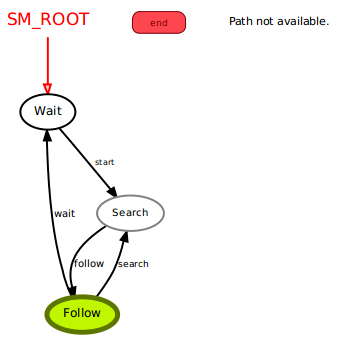

# CMPUT412 FALL 2019 - competition one report


- ***Purpose***  
	     In this competition, each group will implement the following behaviour in their ‘Cop’ robot, to be tested and compared with other robots in a competitive setting. The behaviour will be used to follow i.e. chase a leading ‘Robber’ robot (implemented by the TA) around an oval track without bumping into it. The ‘Robber’ robot will follow a white line and make three loops around a track in CSC 2-29. Your ‘Cop’ robot will be placed behind the Robber robot at the start of the competition. Once the Robber robot starts you must chase the Robber while avoiding ‘rear end’ collisions with it. Your robot is not allowed to follow the white line. It must use the depth sensor to follow the Robber robot.
	     
- ***Pre-requisites***
	- 
	The project is built with python2.7 on Ubuntu 16.04.
	Dependencies include ROS kinetic package, smach state machine, and other drivers for the turtle bot sensor. If these are not installed please refer to the official installation page on ROS wiki or official python installation websites.
	
- Kobuki http://wiki.ros.org/kobuki/Tutorials/Installation/kinetic
- Ros-Kinetic http://wiki.ros.org/kinetic/Installationu 
- Python2 https://www.python.org/downloads/
- Smach http://wiki.ros.org/smach

	The source code of the project can be found at [https://github.com/TianqiCS/CMPUT412-C1](https://github.com/TianqiCS/CMPUT412-C1)
	Create or navigate the existing catkin workspace and clone our repository.

-  ***Execution***
	- 
	Once you have the package in your workspace
	```
	cd catkin_ws
	catkin_make
	source devel/setup.bash
	```
	now you can launch the program using 
	```
	$roslaunch follow_bot follow_bot_real.launch
	```
	After the program is launch, use the joystick to control the turtle bot to follow the object.
- arguments and parameters
	In the launch file follow_bot_real.launch, the file will launch basic driver for the kuboki robot which is essential for the competition ( minimal.launch and 3dsensor.launch). Next, the file will bring up the basic node for this competition like nodelet and joysticks. Finally, there are different sections for in the launch file to give a different view of the field for the robot. By twisting parameters with the name filter, the robot can unaware of anything that is not the target object. How far the robot can see, how fast can the robot turn is also defined in the launch file for further adjustments to the competition.
	In the code file there are serveral functions:
filterColor: it will try to fliter colors execept balck
PC2_callback: it will analysis all the data capture by the camera
Wait state: Wait function will catch the input from the joystick
Search state: It will search for the target if the robot accidently lost the target
Follow state: It will follow the target as expected`
 


- ***Concepts and Strategy***
	- 
Our basic strategy is based on the tutorial given by [https://github.com/pirobot/rbx1](https://github.com/pirobot/rbx1)
Details of our strategy:

-  Initialize the start position (x,y,z) of the 'Robber' robot and the standard distance between the 'Cop' robot and 'Robber' robot (i.e. g_std_dist = 0.8m)
- Define a search box in front of the robot.
- 'Cop' robot goes to 'Wait' state and waits for joystick command.
- Once command received, 'Cop' robot switches to 'Search' State.
WHILE not manually shutdown do:
- Filter out points that are not in the clouds. 
- Filter again evenly to get less points for calculation.
- With these filtered points do:
	- Compute the centroid of the region e.g. avg of x, z value of filtered points
	- If the any centroid value is not NULL (robot has found an object to track), switch to 'Follow' tate
- Compute linear and augular speed to keep the robot following to the 'Robber'
- Publish the speed to move the robot or stop
#### Reminds
- Z-coordinate indicates the distance to the object
- X-coordinate indicates if the object is on the front left or front right of the robot
- In 'Search' state or 'Follow' state, 'Cop' robot switches to 'Wait' state whenever joystick command is received 
- In 'Follow' state, zero centroid z values will cause 'Cop' Robot switch 'Search' state.
- If the target is lost, the robot will automatically turn left trying to find the target.
- The target is 1.3 meters away or further, the robot will accelerate faster.

#### State Machine Graph


#### Other tried features (not implemented in master):
- Since our 'Robber' is running clockwise, we can weight left points x values more, right points x values less. We tried to create x_weight by scaling x values in between 1 and 0 form left to right. Failed reason: when turning left, calculation caused lag and the robot lost target view right away, it's hard to balance several parameters.
- To avoid walls, doors and other stuff, we can weight closer point more, farther point less by multiplying scaled z values with x when calculating centroid x value. 

